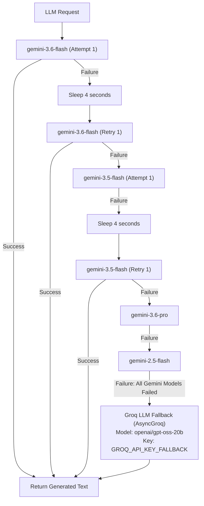

# WandorAI — Project Context & Comprehensive Architectural Blueprint

> **Notice for AI Models and Developers:**  
> This document is the single source of truth for the entire **WandorAI** codebase. It contains exhaustive technical details on the system architecture, multi-agent execution pipeline, external API integrations, data contracts, fallback hierarchies, RAG streaming pipeline, frontend UI implementation, and operating procedures. It is formatted to enable complete, zero-loss comprehension by downstream AI systems and human engineers alike.

---

## Table of Contents

1. [Project Overview & Core Value Proposition](#1-project-overview--core-value-proposition)
2. [High-Level Architecture & LangGraph Workflow](#2-high-level-architecture--langgraph-workflow)
3. [Technology Stack & Dependencies](#3-technology-stack--dependencies)
4. [Directory Structure & File Inventory](#4-directory-structure--file-inventory)
5. [State Management & Data Contracts](#5-state-management--data-contracts)
6. [Specialized Multi-Agent System (Deep-Dive)](#6-specialized-multi-agent-system-deep-dive)
   - [6.1 Orchestrator Agent](#61-orchestrator-agent)
   - [6.2 Flight Search Agent](#62-flight-search-agent)
   - [6.3 Hotel Search Agent](#63-hotel-search-agent)
   - [6.4 Weather Agent](#64-weather-agent)
   - [6.5 Research Agent](#65-research-agent)
   - [6.6 Itinerary Agent](#66-itinerary-agent)
7. [External Services & Integration Layer](#7-external-services--integration-layer)
   - [7.1 Gemini & Groq LLM Engine with Multi-Tier Fallback](#71-gemini--groq-llm-engine-with-multi-tier-fallback)
   - [7.2 Airport & IATA Resolution Service](#72-airport--iata-resolution-service)
   - [7.3 Flight API Service (SerpAPI - Google Flights)](#73-flight-api-service-serpapi---google-flights)
   - [7.4 Hotel API Service (SerpAPI - Google Hotels)](#74-hotel-api-service-serpapi---google-hotels)
   - [7.5 Weather Service (OpenWeatherMap)](#75-weather-service-openweathermap)
   - [7.6 Research Service (Tavily AI)](#76-research-service-tavily-ai)
   - [7.7 RAG Service (ChromaDB + HuggingFace + Groq)](#77-rag-service-chromadb--huggingface--groq)
8. [Backend API Endpoints (FastAPI)](#8-backend-api-endpoints-fastapi)
9. [Frontend Application Architecture (React + Vite + Tailwind)](#9-frontend-application-architecture-react--vite--tailwind)
   - [9.1 View State Machine](#91-view-state-machine)
   - [9.2 Component Breakdown](#92-component-breakdown)
   - [9.3 Resilient API Client & Proxy Layer](#93-resilient-api-client--proxy-layer)
   - [9.4 Design System, Typography & Print Styling](#94-design-system-typography--print-styling)
10. [Configuration & Environment Variables](#10-configuration--environment-variables)
11. [Execution & Run Guide](#11-execution--run-guide)
12. [Testing Infrastructure & Scratch Scripts](#12-testing-infrastructure--scratch-scripts)
13. [Key Engineering Decisions, Edge Cases & Error Handling](#13-key-engineering-decisions-edge-cases--error-handling)
14. [Guidelines for Downstream AI Models Analyzing this Codebase](#14-guidelines-for-downstream-ai-models-analyzing-this-codebase)

---

## 1. Project Overview & Core Value Proposition

**WandorAI** (version `1.0.0`) is an enterprise-grade, multi-agent AI travel planning application. It takes arbitrary, natural-language travel requests from a user (e.g., *"Plan a 7-day trip to Tokyo from Hyderabad with a moderate budget starting March 24, 2026"*) and autonomously:

1. **Extracts and structures requirements** (origin, destination, dates, traveler counts, budgets, constraints, preferences).
2. **Identifies missing critical variables** and enters an interactive clarification loop if needed.
3. **Resolves location entities** to global airport IATA codes (e.g., Hyderabad $\rightarrow$ `HYD`, Tokyo $\rightarrow$ `HND`/`NRT`).
4. **Executes concurrent real-world data retrieval** across specialized agents:
   - Live flight search via Google Flights engine (via SerpAPI).
   - Live hotel / accommodation search via Google Hotels engine (via SerpAPI).
   - Real-time weather forecasts and climate summaries via OpenWeatherMap.
   - Deep web destination research, attraction discovery, and tips via Tavily AI.
5. **Synthesizes grounded outputs** into a comprehensive travel package:
   - A multi-category budget estimation (flights, hotels, food, local transport, activities).
   - A day-by-day Markdown itinerary with logistical guidance, neighborhoods, timing, and direct hotel/flight recommendations.
6. **Indexes the itinerary into a vector database** (ChromaDB with local `all-MiniLM-L6-v2` embeddings) to enable a real-time conversational RAG assistant that answers contextual traveler questions using Groq LLM streaming.
7. **Presents results across two interfaces**:
   - A modern, aesthetic React 19 web application featuring glassmorphism, responsive tabbed cards, print-ready PDF styling, and an integrated assistant drawer.
   - An interactive command-line interface (`cli.py`).

---

## 2. High-Level Architecture & LangGraph Workflow

WandorAI uses **LangGraph** (`StateGraph`) as its primary deterministic coordination engine. The graph is stateless across distinct requests but supports conversational memory and multi-turn clarification through state passing (`session_context`).

### Visual Flow Diagram

```mermaid
flowchart TD
    Start([User Travel Request]) --> OrchestrateNode[Node: orchestrate]
    
    OrchestrateNode --> RouteClarify{Needs Clarification?}
    
    RouteClarify -- Yes: Missing Destination or Duration --> ClarifyResponse([Status: needs_clarification])
    ClarifyResponse -. User submits clarification .-> OrchestrateNode
    
    RouteClarify -- No: Sufficient Data --> GatherDataNode[Node: gather_data]
    
    subgraph ParallelDataGathering [Parallel Agent Execution (asyncio.gather)]
        direction TB
        FlightAgent[Flight Search Agent\n(IATA Resolver + SerpAPI Flights)]
        HotelAgent[Hotel Search Agent\n(SerpAPI Hotels)]
        WeatherAgent[Weather Agent\n(OpenWeather Geocode + Forecast)]
        ResearchAgent[Research Agent\n(Tavily Advanced Web Search)]
    end
    
    GatherDataNode --> FlightAgent
    GatherDataNode --> HotelAgent
    GatherDataNode --> WeatherAgent
    GatherDataNode --> ResearchAgent
    
    FlightAgent --> SynthesizeNode[Node: synthesize]
    HotelAgent --> SynthesizeNode
    WeatherAgent --> SynthesizeNode
    ResearchAgent --> SynthesizeNode
    
    SynthesizeNode --> ItineraryAgentBudget[ItineraryAgent.estimate_budget]
    ItineraryAgentBudget --> ItineraryAgentPlan[ItineraryAgent.generate_itinerary]
    
    ItineraryAgentPlan --> CompleteResponse([Status: complete])
    
    CompleteResponse --> RAGInit[Frontend calls /chat/init]
    RAGInit --> ChromaStore[(In-Memory Chroma Vector Store)]
    ChromaStore -. Top-3 Similarity Search .-> RAGQuery[Groq SSE Stream /chat/query]
```

### Graph Node Specifications

| Node Name | Function Pointer | Input State Keys | Output State Keys | Description |
|-----------|------------------|------------------|-------------------|-------------|
| `orchestrate` | `TravelPlannerGraph._orchestrate` | `user_request`, `prior_context`, `clarification_response` | `travel_context`, `missing_fields`, `clarification_question`, `needs_clarification`, `status`, `message`, `errors` | Analyzes request with LLM, extracts parameters, applies calendar defaults, checks for critical missing fields. |
| `gather_data` | `TravelPlannerGraph._gather_data` | `travel_context` | `flights`, `hotels`, `weather`, `research`, `errors` | Fires 4 coroutines concurrently via `asyncio.gather` with isolated error capture so failure in one agent doesn't crash others. |
| `synthesize` | `TravelPlannerGraph._synthesize` | `travel_context`, `flights`, `hotels`, `weather`, `research` | `budget`, `itinerary`, `status`, `message` | Computes itemized budget and generates formatted day-by-day Markdown itinerary. |

### Routing Logic (`_route_after_orchestration`)
- **`clarify`**: If `state["needs_clarification"] == True`, execution terminates immediately (`END`), returning the clarification question to the user.
- **`continue`**: If parameters are sufficient, control transitions to `gather_data`.

---

## 3. Technology Stack & Dependencies

### Backend Dependencies (`requirements.txt`)
- **Orchestration & Workflow:** `langgraph>=0.2.0`, `langchain-core>=0.3.0`
- **LLM Integrations:** `google-genai>=1.65.0`, `langchain-google-genai>=2.0.0`, `groq>=0.11.0`, `langchain-groq>=0.2.0`
- **RAG & Embeddings:** `langchain-chroma>=0.1.4`, `chromadb>=1.5.0`, `sentence-transformers>=3.2.0`, `langchain-huggingface>=0.1.0`, `langchain-text-splitters>=1.1.0`
- **API Server & Async I/O:** `fastapi>=0.115.0`, `uvicorn[standard]>=0.32.0`, `httpx>=0.27.0`
- **Configuration & Validation:** `pydantic>=2.0.0`, `pydantic-settings>=2.0.0`, `python-dotenv>=1.0.0`
- **Domain Tools:** `airportsdata>=20241001`, `tavily-python>=0.5.0`

### Frontend Dependencies (`frontend/package.json`)
- **Core Framework:** `react@^19.2.8`, `react-dom@^19.2.8`, `typescript@~6.0.2`
- **Build System:** `vite@^8.2.0`, `@vitejs/plugin-react@^6.0.4`
- **CSS & UI Framework:** `tailwindcss@^3.4.19`, `postcss@^8.5.26`, `autoprefixer@^10.5.4`
- **Components & Icons:** `lucide-react@^1.32.0`, `react-markdown@^10.1.0`
- **Linter:** `oxlint@^1.75.0`

---

## 4. Directory Structure & File Inventory

```
Test2/
├── .env                          # Local secrets, API keys, and model parameters
├── .gitignore                    # Git ignore configurations (Python, Node, logs, etc.)
├── Context.md                    # Single-source-of-truth system context (this file)
├── README.md                     # High-level developer documentation & quick-start
├── cli.py                        # Standalone interactive terminal application
├── list_models.py                # Utility script to query available Google GenAI models
├── requirements.txt              # Strict Python dependencies specification
├── run_test.py                   # Automated end-to-end travel planner integration test
├── run_test_2.py                 # Edge-case test (planning without origin location)
├── scratch_test_airport.py       # Scratch diagnostic for airport IATA code resolution
├── scratch_test_flight_agent.py  # Scratch diagnostic for FlightSearchAgent
├── scratch_test_flights.py       # Scratch diagnostic for SerpAPI Google Flights queries
├── scratch_test_graph.py         # Scratch diagnostic for LangGraph pipeline
├── test_fallback.py              # Test verifying Gemini -> Groq fallback chain
├── test_groq.py                  # Test validating Groq API connectivity and LLM responses
├── test_hotel_api.py             # Test verifying SerpAPI Google Hotels search and parsing
├── test_orchestrator.py          # Test verifying Orchestrator parameter extraction
├── test_output.json              # Sample JSON output generated from successful test runs
├── app/
│   ├── __init__.py               # Package metadata and version definition ("1.0.0")
│   ├── config.py                 # Pydantic BaseSettings loading from .env
│   ├── graph.py                  # LangGraph StateGraph coordinator and singleton planner
│   ├── main.py                   # FastAPI REST application and endpoint routers
│   ├── models.py                 # Core Pydantic request/response schemas
│   ├── rag_service.py            # ChromaDB vector store and Groq streaming query service
│   ├── state.py                  # LangGraph TypedDict state schema definition
│   ├── agents/
│   │   ├── __init__.py           # Agent module exports
│   │   ├── flight_agent.py       # Flight search agent (IATA validation + SerpAPI parsing)
│   │   ├── hotel_agent.py        # Hotel search agent (date formatting + SerpAPI parsing)
│   │   ├── itinerary_agent.py    # Budget estimation & Markdown itinerary generator
│   │   ├── orchestrator.py       # NLP extraction agent, date inferencer & clarifier
│   │   ├── research_agent.py     # Tavily-powered destination researcher
│   │   └── weather_agent.py      # OpenWeather forecast & climate summarizer
│   └── services/
│       ├── __init__.py           # Services module exports
│       ├── airport.py            # Local airportsdata loader + AviationStack fallback
│       ├── flight_api.py         # SerpAPI Google Flights HTTP client
│       ├── gemini.py             # Google GenAI client with multi-model retry & Groq fallback
│       ├── hotel_api.py          # SerpAPI Google Hotels HTTP client
│       ├── openweather.py        # OpenWeather geocoding and forecast HTTP client
│       └── tavily.py             # TavilyClient wrapper for advanced travel search
└── frontend/
    ├── .gitignore                # Frontend-specific git exclusions
    ├── .oxlintrc.json            # Oxlint configuration
    ├── index.html                # HTML entry point with Google Fonts preconnections
    ├── package.json              # Node dependencies, scripts, and metadata
    ├── package-lock.json         # Pinned npm dependencies tree
    ├── postcss.config.js         # PostCSS configuration with Tailwind and Autoprefixer
    ├── tailwind.config.js        # Tailwind design system extensions (colors, fonts)
    ├── tsconfig.json             # TypeScript root project references
    ├── tsconfig.app.json         # TypeScript configuration for app source files
    ├── tsconfig.node.json        # TypeScript configuration for Vite configuration
    ├── vite.config.ts            # Vite bundler configuration and backend proxy routes
    └── src/
        ├── App.css               # Component styling
        ├── App.tsx               # Top-level view router, state coordinator, and modals
        ├── api.ts                # Resilient multi-URL fetch client for backend endpoints
        ├── index.css             # Tailwind directives, SVG paper texture, print styles
        ├── main.tsx              # React 19 root renderer
        └── components/
            ├── Hero.tsx          # Video background landing hero and prompt card
            ├── Login.tsx         # Travel-themed authentication mock with validation
            └── Results.tsx       # Itinerary renderer, tab switcher, cards & RAG chat
```

---

## 5. State Management & Data Contracts

All data traversing the LangGraph agent workflow adheres to standard schemas defined in `app/models.py` and `app/state.py`.

### 5.1 LangGraph State: `TravelState` (`app/state.py`)
```python
class TravelState(TypedDict, total=False):
    user_request: str                        # Raw natural language prompt
    clarification_response: str | None       # User response to clarification question
    prior_context: dict[str, Any] | None     # Injected memory from prior turn

    travel_context: TravelContext            # Extracted structured requirements
    missing_fields: list[str]                # Fields missing from input
    clarification_question: str | None       # Clarification question to prompt user
    needs_clarification: bool                # Boolean gating routing decision

    flights: list[FlightOption]              # Normalized flights (top 5)
    hotels: list[HotelOption]                # Normalized hotels (top 5)
    weather: WeatherForecast | None          # Weather forecast object
    research: list[ResearchResult]           # Tavily web research highlights & sources
    budget: BudgetEstimate | None            # Itemized budget breakdown
    itinerary: str | None                    # Synthesized Markdown itinerary

    errors: Annotated[list[str], operator.add] # Monoid error accumulator across nodes
    status: str                              # "in_progress" | "complete" | "needs_clarification" | "error"
    message: str                             # Human-readable status or reasoning
```

### 5.2 Core Domain Models (`app/models.py`)

#### `TravelContext`
Represents the structured interpretation of the trip:
- `destination`: `str | None`
- `destination_iata`: `str | None` (3-letter IATA code, e.g., "HND")
- `origin`: `str | None`
- `origin_iata`: `str | None` (3-letter IATA code, e.g., "HYD")
- `duration_days`: `int | None`
- `departure_date`: `str | None` (`YYYY-MM-DD`)
- `return_date`: `str | None` (`YYYY-MM-DD`)
- `travelers`: `int` (default: 1)
- `budget_preference`: `"low" | "moderate" | "high" | "luxury" | None`
- `budget_amount`: `float | None`
- `currency`: `str` (default: `"INR"`)
- `preferences`: `list[str]` (e.g., `["nature", "quiet places", "local cuisine"]`)
- `constraints`: `list[str]`
- `trip_purpose`: `str | None`
- `inferred_fields`: `list[str]` (tracks fields filled automatically by defaults)

#### `FlightOption`
- `airline`: `str | None`
- `departure_airport`, `arrival_airport`: `str | None` (e.g., "Indira Gandhi International [DEL]")
- `departure_time`, `arrival_time`: `str | None`
- `duration`: `str | None` (e.g., "1h 15m")
- `stops`: `int | None` (0 for direct)
- `price`: `float | None`
- `currency`: `str` (default: "INR")
- `booking_link`: `str | None`
- `raw`: `dict[str, Any]` (original SerpAPI flight payload)

#### `HotelOption`
- `name`: `str | None`
- `location`: `str | None`
- `price_per_night`, `total_price`: `float | None`
- `rating`: `float | None` (e.g., 4.5)
- `review_count`: `int | None`
- `amenities`: `list[str]`
- `booking_link`: `str | None`
- `raw`: `dict[str, Any]`

#### `WeatherForecast`
- `location`: `str`
- `summary`: `str` (e.g., *"Expect highs around 18–24°C with conditions such as clear sky, light rain."*)
- `daily`: `list[dict[str, Any]]` (contains `temp_min`, `temp_max`, `description`, `humidity`, `wind_speed`)
- `raw`: `dict[str, Any]`

#### `ResearchResult`
- `query`: `str`
- `summary`: `str` (Tavily direct answer)
- `highlights`: `list[str]` (Formatted `"Title: Snippet"` entries)
- `sources`: `list[dict[str, str]]` (`title`, `url`)

#### `BudgetEstimate`
- `flights`, `accommodation`, `activities`, `food`, `local_transport`, `total`: `float | None`
- `currency`: `str` ("INR")
- `notes`: `str`
- `breakdown`: `dict[str, Any]`

#### `TravelPlanRequest`
- `message`: `str` (min length 3)
- `clarification_response`: `str | None`
- `session_context`: `dict[str, Any] | None`

#### `TravelPlanResponse`
- `status`: `"complete" | "needs_clarification" | "error"`
- `message`: `str`
- `clarification_question`: `str | None`
- `travel_context`: `TravelContext | None`
- `flights`: `list[FlightOption]`
- `hotels`: `list[HotelOption]`
- `weather`: `WeatherForecast | None`
- `research`: `list[ResearchResult]`
- `budget`: `BudgetEstimate | None`
- `itinerary`: `str | None`
- `session_context`: `dict[str, Any] | None`
- `errors`: `list[str]`

---

## 6. Specialized Multi-Agent System (Deep-Dive)

Each agent in `app/agents/` is a dedicated, single-responsibility class designed to isolate reasoning and API calls.

### 6.1 Orchestrator Agent (`app/agents/orchestrator.py`)
- **Role:** Extracts entities from natural language into `TravelContext`, fills missing dates using deterministic rules, and evaluates ambiguity.
- **System Prompt Rules:**
  - Enforces JSON output without Markdown wrappers.
  - Automatically sets `travelers = 1` and `currency = "INR"` if not specified.
  - Detects budget preferences (`"low"`, `"moderate"`, `"high"`, `"luxury"`).
- **Date Inference Algorithm (`_apply_defaults`):**
  - If `duration_days` is given but `departure_date` is omitted, infers `departure_date` as **today + 28 days (4 weeks)**.
  - If `departure_date` is known but `return_date` is omitted, computes:  
    $$\text{return\_date} = \text{departure\_date} + (\text{duration\_days} - 1)\text{ days}$$
  - Logs inferred fields inside `inferred_fields`.
- **Clarification Decision (`needs_clarification`):**
  - Returns `True` if `destination` or `duration_days` cannot be determined.
  - Formulates a single, targeted `clarification_question`.

### 6.2 Flight Search Agent (`app/agents/flight_agent.py`)
- **Role:** Gathers real flight options between origin and destination.
- **Workflow:**
  1. Resolves `origin` and `destination` city names into 3-letter IATA codes using `AirportService`.
  2. If the origin airport cannot be resolved, appends a graceful warning to `errors` and returns an empty flight list instead of crashing the pipeline.
  3. Invokes `FlightApiService.search_flights()`.
  4. Parses `best_flights` and `other_flights` lists from the SerpAPI payload.
  5. Computes flight leg layovers: `stops = max(len(legs) - 1, 0)`.
  6. Enriches airport codes with human-readable names (e.g., `HND` $\rightarrow$ `Tokyo Haneda [HND]`).
  7. Returns the top 5 sorted flight options.

### 6.3 Hotel Search Agent (`app/agents/hotel_agent.py`)
- **Role:** Gathers real accommodation listings for the destination.
- **Date Normalization:** Contains an internal regex parser that converts `DD-MM-YYYY` dates into ISO `YYYY-MM-DD` to prevent SerpAPI formatting errors.
- **Workflow:**
  1. Formulates search query: `f"hotels in {context.destination}"`.
  2. Invokes `HotelApiService.search_hotels()`.
  3. Extracts lowest available pricing via `_extract_price()` (handles nested rate dictionaries like `extracted_lowest`).
  4. Collects hotel name, address, user ratings, review counts, and amenities.
  5. Returns the top 5 accommodation options.

### 6.4 Weather Agent (`app/agents/weather_agent.py`)
- **Role:** Fetches climate forecasts for the destination duration.
- **Workflow:**
  1. Defaults duration to 5 days if unspecified.
  2. Calls `OpenWeatherService.get_forecast()`.
  3. Aggregates min/max temperatures, humidity, wind speeds, and cloud conditions.
  4. Produces a synthesized natural-language summary (e.g., *"Expect highs around 22–27°C with scattered clouds"*).

### 6.5 Research Agent (`app/agents/research_agent.py`)
- **Role:** Performs real-time web research on attractions, local etiquette, food, and neighborhoods.
- **Query Formulation:**
  ```python
  query = (
      f"Best things to do in {destination} for a {days}-day trip. "
      f"Include attractions, neighborhoods, food, and local tips. "
      f"Preferences: {prefs}."
  )
  ```
- **Tavily Configuration:** Uses `search_depth="advanced"`, retrieves top 6 results, extracts Tavily's generated answer, and returns up to 8 snippet highlights with verified web source URLs.

### 6.6 Itinerary Agent (`app/agents/itinerary_agent.py`)
- **Role:** Synthesizes all gathered real-world data into an itemized budget and a comprehensive day-by-day Markdown itinerary.
- **Budget Estimation (`estimate_budget`):**
  - Prompted with the travel context, flights, and hotels data.
  - Returns a realistic financial breakdown for flights, lodging, meals, local transit, and activities in the target currency (`INR`).
- **Itinerary Generation (`generate_itinerary`):**
  - Operates under strict **Formatting Rules**:
    - `# Title` for main itinerary name.
    - `## Section` for *Trip Overview*, *Recommended Flight & Hotel Picks*, *Day-by-Day Itinerary*, and *Practical Tips*.
    - `### Sub-sections` for *Morning*, *Afternoon*, and *Evening*.
    - **Bold text** for timings, landmarks, prices, and locations.
    - Explicitly incorporates the actual airlines, hotels, and prices found by the research agents.

---

## 7. External Services & Integration Layer

### 7.1 Gemini & Groq LLM Engine with Multi-Tier Fallback (`app/services/gemini.py`)
WandorAI features a resilient, fault-tolerant LLM invocation pipeline that prevents downtime caused by model deprecations, API outages, or rate-limiting:



1. **Primary Model:** `gemini-3.6-flash` (via official `google-genai` SDK).
2. **Fallback Chain:** `["gemini-3.5-flash", "gemini-3.6-pro", "gemini-2.5-flash"]`.
3. **Retry Strategy:** On failure, waits 4 seconds and retries the same model once before stepping down to the next fallback model.
4. **Ultimate Fallback:** If all Google Gemini models fail, automatically engages `AsyncGroq` using model `openai/gpt-oss-20b` and `GROQ_API_KEY_FALLBACK`.
5. **JSON Extraction:** `_extract_json()` uses regex fences ```` ```(?:json)? ... ``` ```` combined with first `{` and last `}` substring extraction to guarantee clean JSON parsing even if the LLM surrounds its output with conversational prose.

### 7.2 Airport & IATA Resolution Service (`app/services/airport.py`)
Translates city and destination names to verified IATA 3-letter codes:
1. **Primary Database:** Local `airportsdata` dictionary (`load("IATA")`), containing tens of thousands of global airports in offline memory.
2. **Local Matching Algorithm:**
   - Exact city or airport name match: Score = 100
   - Substring in city or airport name: Score = 80
   - Prefix match: Score = 60
   - Country match: Score = 20
   - Major hub tie-breaker: Adds +5 if `'international'` is in the name.
3. **Secondary Online Fallback:** If local search yields no results, calls the **AviationStack Autocomplete API** (`/v1/autocomplete`) using `AVIATIONSTACK_API_KEY`.
4. **Enrichment:** `enrich_flight_airports()` converts plain IATA codes into human-readable labels: e.g., `"DEL"` $\rightarrow$ `"Indira Gandhi International (Delhi) [DEL]"`.

### 7.3 Flight API Service (`app/services/flight_api.py`)
- **Provider:** SerpAPI (`https://serpapi.com/search.json`).
- **Engine:** `google_flights`.
- **Key Parameters:**
  - `departure_id`: Origin IATA.
  - `arrival_id`: Destination IATA.
  - `outbound_date`, `return_date`: Formatted dates.
  - `type`: `1` (round trip) if return date is present, otherwise `2` (one way).
  - `deep_search`: `"true"` (forces thorough itinerary scraping).
  - `currency`: Default `"INR"`.

### 7.4 Hotel API Service (`app/services/hotel_api.py`)
- **Provider:** SerpAPI.
- **Engine:** `google_hotels`.
- **Key Parameters:**
  - `q`: Search query (e.g., `"hotels in Paris"`).
  - `check_in_date`, `check_out_date`: Formatted dates.
  - `adults`: Traveler count.
  - `currency`: Default `"INR"`.

### 7.5 Weather Service (`app/services/openweather.py`)
- **Provider:** OpenWeatherMap API.
- **Step 1 (Geocoding):** Queries `https://api.openweathermap.org/geo/1.0/direct?q={location}&limit=1` to retrieve latitude, longitude, and formal country codes.
- **Step 2 (Forecast):** Queries `https://api.openweathermap.org/data/2.5/forecast` with `units=metric` and `cnt=min(days, 5)*8` (8 three-hour intervals per 24 hours).
- **Step 3 (Aggregation):** Computes day-by-day temperatures, weather conditions, humidity, and wind speed.

### 7.6 Research Service (`app/services/tavily.py`)
- **Provider:** Tavily AI Search (`tavily-python`).
- Performs advanced web research specifically filtered for travel itineraries, cultural practices, tourist passes, top culinary experiences, and safety tips.

### 7.7 RAG Service (`app/rag_service.py`)
Provides an interactive in-memory vector search and streaming Q&A service over generated itineraries:
1. **Vector Store:** In-memory `Chroma` instances indexed by `session_id` in a global dictionary `_SESSION_STORES`.
2. **Text Chunking:** `RecursiveCharacterTextSplitter(chunk_size=500, chunk_overlap=50)`.
3. **Embeddings:** HuggingFace `all-MiniLM-L6-v2` loaded lazily on first access.
4. **Query & Retrieval:** Retrieves top 3 most relevant itinerary chunks using cosine similarity search.
5. **Streaming Generation:** Formulates a strict, anti-hallucination system prompt and streams text chunks from Groq (`openai/gpt-oss-20b`, `temperature=0.2`) via an async generator.

---

## 8. Backend API Endpoints (FastAPI)

FastAPI application is instantiated in `app/main.py` with CORS configured for `http://localhost:5173` and `http://127.0.0.1:5173`.

### 8.1 `GET /health`
Verifies backend status and returns configuration state of all required services:
```json
{
  "status": "ok",
  "gemini_configured": "True",
  "flight_api_configured": "True",
  "hotel_api_configured": "True",
  "openweather_configured": "True",
  "tavily_configured": "True"
}
```

### 8.2 `POST /plan`
- **Request Body:** `TravelPlanRequest` (`{"message": "...", "clarification_response": "...", "session_context": {...}}`)
- **Response Body:** `TravelPlanResponse`
- **Behavior:**
  - Validates `GOOGLE_API_KEY` presence (returns HTTP 503 if missing).
  - Invokes `TravelPlannerGraph.run()`.
  - Returns `status: "needs_clarification"` with a `clarification_question` and `session_context` if destination/dates are ambiguous.
  - Returns `status: "complete"` with full flights, hotels, weather, research, budget, and itinerary when successful.

### 8.3 `POST /chat/init`
- **Request Body:** `ChatInitRequest` (`{"session_id": "...", "itinerary_text": "..."}`)
- **Response Body:** `{"status": "success", "message": "Vector store initialized."}`
- **Behavior:** Chunks the generated itinerary and indexes it into ChromaDB for that session.

### 8.4 `POST /chat/query`
- **Request Body:** `ChatQueryRequest` (`{"session_id": "...", "query": "..."}`)
- **Response:** `StreamingResponse` (`media_type="text/event-stream"`)
- **Behavior:** Streams tokens from Groq as the AI answers the user's question using the retrieved itinerary chunks.

---

## 9. Frontend Application Architecture (React + Vite + Tailwind)

The frontend is a single-page application built with React 19 and Vite 8, styled using Tailwind CSS and custom typography.

### 9.1 View State Machine (`frontend/src/App.tsx`)
The top-level `App` component manages a five-state view machine:

```
[home] ──(Click 'Plan My Trip')──> [loading] ──(API Response)──> [results]
  │                                     │
  ├──(Click 'wandor' / Auth)            ├──(If missing critical info)
  │                                     │
  ▼                                     ▼
[login]                             [clarify] ──(Submit Clarification)──> [loading]
```

1. **`home`**: Full-screen video hero with liquid glass prompt input.
2. **`loading`**: Animated vintage compass spinner with pulsing watercolor gradients.
3. **`clarify`**: High-priority modal requesting clarification for missing parameters, preserving prior context.
4. **`results`**: Multi-tab display (Itinerary, Flights, Hotels, Weather), journey header, budget cards, and RAG assistant.
5. **`login`**: Aesthetic authentication modal with email/password validation and social login simulation.

### 9.2 Component Breakdown

#### `Hero.tsx` (`frontend/src/components/Hero.tsx`)
- Renders an auto-playing, muted, looping background video with a gradient overlay.
- Houses the liquid glass prompt card (`backdrop-blur-[20px]`) with prefilled default prompt: *"Plan a 7-day trip to Tokyo from Hyderabad with a moderate budget starting March 24, 2026."*
- Dispatches `onPlanTrip(promptText)`.

#### `Results.tsx` (`frontend/src/components/Results.tsx`)
- **Trip Summary Banner:** Displays origin, destination, dates, round-trip status, and traveler count.
- **Tabbed Interface:**
  - **Itinerary:** Renders rich Markdown via `ReactMarkdown` with custom typography. Displays itemized budget cards (Flights, Hotels, Food & Transit, Activities, Total). Contains a **Download PDF** button triggering clean `@media print` CSS.
  - **Flights:** Renders flight cards with airlines, departure/arrival times, stops, duration, and formatted prices.
  - **Hotels:** Renders hotel cards with location, star rating, reviews, nightly price, and amenities badges.
  - **Weather:** Renders weather condition summaries and daily high/low cards.
- **Floating RAG Chatbot Drawer:**
  - Auto-initializes on mount via `/chat/init`.
  - Floating trigger button with sparkles icon.
  - Real-time text decoder reading chunks from `/chat/query` SSE stream.

#### `Login.tsx` (`frontend/src/components/Login.tsx`)
- Vintage travel aesthetic with paper texture and organic watercolor patches.
- Dual-column layout: left column displays destination illustration (`/illustration.jpg`); right column houses authentication card.
- Mock credentials: `demo@wandor.ai` / `password123`.

### 9.3 Resilient API Client & Proxy Layer (`frontend/src/api.ts` & `vite.config.ts`)
To prevent connection failures caused by differing local environments (`localhost` vs `127.0.0.1` vs relative routes), `frontend/src/api.ts` implements a multi-candidate fallback client:

```typescript
const ENDPOINT_CANDIDATES = [
  '/plan',
  'http://localhost:8000/plan',
  'http://127.0.0.1:8000/plan'
];
```
In development, `vite.config.ts` proxies `/plan`, `/chat`, and `/health` requests directly to `http://127.0.0.1:8000`.

### 9.4 Design System, Typography & Print Styling
- **Fonts (`frontend/index.html` & `tailwind.config.js`):**
  - `Geist`: Main modern sans-serif.
  - `DM Serif Display`: Editorial headlines and section titles.
  - `Special Elite`: Vintage typewriter wordmark for `"wandor"`.
  - `Inter`: Body reading typography.
- **Paper Texture (`frontend/src/index.css`):** SVG fractal noise filter generating subtle grain across backgrounds.
- **Print Optimization (`@media print`):** Automatically hides navigation bars, buttons, and backgrounds, formatting the Markdown itinerary and budget table into a clean, paginated PDF report.

---

## 10. Configuration & Environment Variables

All settings are managed via `app/config.py` using Pydantic `BaseSettings` reading from `.env`.

| Environment Variable | Required | Default / Example Value | Description |
|----------------------|----------|-------------------------|-------------|
| `GOOGLE_API_KEY` | **Yes** | `AQ.Ab8RN6...` | Google GenAI API key for Gemini models |
| `GROQ_API_KEY` | **Yes** | `gsk_WcdzaJ...` | Groq API key for interactive RAG chatbot queries |
| `GROQ_API_KEY_FALLBACK` | **Yes** | `gsk_Zq3XvX...` | Groq API key for emergency LLM fallback when Gemini is unavailable |
| `FLIGHT_API_KEY` | Recommended | `f067a06f3...` | SerpAPI key for Google Flights search |
| `HOTEL_API_KEY` | Recommended | `f067a06f3...` | SerpAPI key for Google Hotels search |
| `OPENWEATHER_API_KEY` | Recommended | `feb7a214...` | OpenWeatherMap API key for geocoding & forecast |
| `TAVILY_API_KEY` | Recommended | `tvly-dev-1...` | Tavily API key for web research |
| `AVIATIONSTACK_API_KEY` | Optional | `0d3735ae...` | AviationStack key for airport lookup fallback |
| `GEMINI_MODEL` | No | `"gemini-3.6-flash"` | Primary Gemini model identifier |
| `GROQ_FALLBACK_MODEL` | No | `"openai/gpt-oss-20b"` | Fallback model used with Groq |

---

## 11. Execution & Run Guide

### 11.1 Running the API Server (Backend)
Ensure the virtual environment is activated, then run:
```powershell
# Windows
.\venv\Scripts\uvicorn.exe app.main:app --host 127.0.0.1 --port 8000 --reload

# macOS / Linux
./venv/bin/uvicorn app.main:app --host 127.0.0.1 --port 8000 --reload
```
- **Health check:** `http://127.0.0.1:8000/health`
- **Swagger Documentation:** `http://127.0.0.1:8000/docs`

### 11.2 Running the Frontend (Vite)
Navigate to the `frontend/` directory:
```powershell
# Windows (use npm.cmd if PowerShell execution policy blocks npm.ps1)
npm.cmd run dev

# macOS / Linux
npm run dev
```
- **Web UI:** `http://localhost:5173/`

### 11.3 Running the Interactive CLI
For terminal-only interactive planning:
```powershell
.\venv\Scripts\python.exe cli.py
```

---

## 12. Testing Infrastructure & Scratch Scripts

The repository includes targeted scripts for validating individual layers:

| Test File | Target Component | Description |
|-----------|------------------|-------------|
| `run_test.py` | Full Pipeline | End-to-end integration test (Delhi $\rightarrow$ Tokyo, 1 traveler) exporting to `test_output.json`. |
| `run_test_2.py` | Missing Origin Edge Case | Tests planning when user omits origin city. |
| `test_orchestrator.py` | `OrchestratorAgent` | Tests NLP requirement extraction. |
| `test_hotel_api.py` | `HotelSearchAgent` | Tests SerpAPI hotel queries and price parser. |
| `scratch_test_flights.py` | `FlightApiService` | Diagnostic for SerpAPI Google Flights responses. |
| `scratch_test_airport.py` | `AirportService` | Tests IATA code resolution for cities (e.g., Hyderabad, Dubai). |
| `test_groq.py` | Groq Integration | Verifies connectivity to Groq LLM API. |
| `test_fallback.py` | `app/services/gemini.py` | Simulates invalid Gemini models to verify failover to Groq. |
| `list_models.py` | Google GenAI SDK | Queries Google API to display available models on the current API key. |

---

## 13. Key Engineering Decisions, Edge Cases & Error Handling

1. **Non-Blocking Partial Failures:** If external APIs (SerpAPI, OpenWeather, or Tavily) experience rate limits or network issues, the individual agent catches the exception and appends a human-readable notice to `state["errors"]`. The pipeline continues and generates the itinerary with the available data rather than failing the entire request.
2. **Missing Departure City:** If a user does not supply an origin city, the system skips flight search gracefully, informs the user in `errors`, and still generates hotel, weather, and activity plans for the destination.
3. **UTF-8 File Encodings:** Scripts writing JSON output specify `encoding="utf-8"` to prevent Windows `cp1252` encoding errors caused by unicode emojis (such as airplanes $\small\text{✈}$ or stars $\small\text{★}$).
4. **PowerShell Execution Policies:** On Windows machines where PowerShell script execution is restricted, npm commands should be invoked via `npm.cmd` rather than `npm`.
5. **Session-Isolated RAG Stores:** The vector database stores itineraries in in-memory Chroma indices isolated by `session_id`, ensuring conversations from different planning sessions do not collide or leak context.

---

## 14. Guidelines for Downstream AI Models Analyzing this Codebase

When ingesting this file into any AI model to perform code modifications, feature development, or audits:

1. **State Preservation:** Always ensure any modifications to `TravelPlannerGraph` nodes adhere strictly to the `TravelState` TypedDict schema in `app/state.py`.
2. **Fallback Chain Respect:** When updating LLM prompts or calling conventions in `app/services/gemini.py`, preserve both the retry loop and the Groq fallback fallback mechanism.
3. **Date Format Conformity:** External travel engines expect ISO `YYYY-MM-DD` dates. Any user-facing date transformation must preserve or convert to this format before hitting `app/services/`.
4. **Resilient Frontend Fetching:** Never hardcode a single localhost URL in frontend components; use `fetchPlan` from `frontend/src/api.ts` or Vite proxy paths (`/plan`, `/chat`) to maintain cross-environment reliability.
5. **No Code Removal in Other Files:** As requested by the repository maintainer, all architectural context must be recorded here in `Context.md` without modifying other files in the project.
